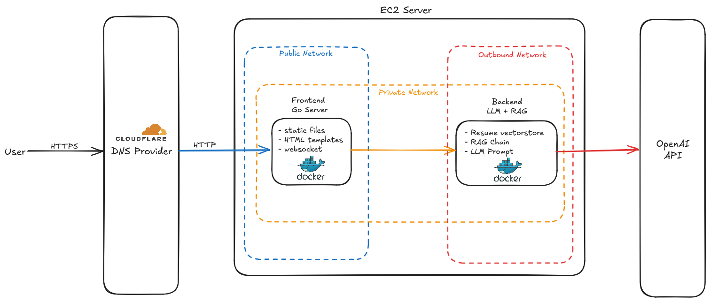

# Resume App

<https://drtaylor.xyz>

## Architecture

- The frontend is served using Go Fiber web server, Templ for rendering dynamic
data in HTML, and HTMX for client-server interaction.
- Chat inquiries are delivered to the LLM through a websocket connection between
the client and the Go server. Queries are relayed to a private API
written with Python's FastAPI, exposing the LLM to the Go server.
- The LLM, gpt-4o-mini, accesses relevant sections of my resume through a ChromaDB
vectorstore which is created prior to deployment.
- The Go server and Python server are containerized using Docker and deployed on
an AWS EC2 instance with the docker compose plugin to manage networking.

## Diagram

## Tasks

- [x] Frontend layout
- [x] Backend in Go to serve pages and websocket
- [x] LLM + RAG for personal resume
- [x] Render chat submissions/responses in htmx response
- [x] Backend interface between web server and LangChain pipeline
- [x] infrastructure defined in terraform
